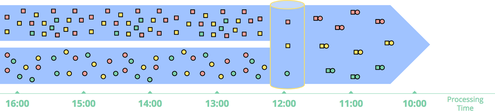
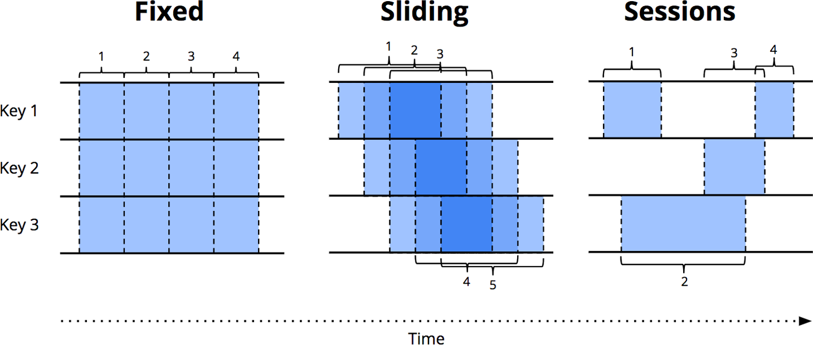

# Background

## What is streaming?

- [Streaming 101: The world beyond batch](https://www.oreilly.com/radar/the-world-beyond-batch-streaming-101/)
- [Streaming 102: The world beyond batch](https://www.oreilly.com/radar/the-world-beyond-batch-streaming-102/)

### Streaming Systems

a type of **data processing engine** that is designed **with infinite data sets** in mind.

#### Datasets' dimension

two orthogonal properties:

- **Cardinality**: *size* of data sets
  - **bounded data**: finite "batch" data sets
  - **unbounded data**: infinite "streaming" data sets. a type of ever-growing, essentially infinite data set.
- **Constitution**: *physical manifestation* of data sets. it defines the ways one can interact with the data in question.
  - **table**: a holistic view of a dataset at a specific point in time. 
  - **stream**: an element-by-element view of the evolution of a dataset over time.

### Lambda Architecture

- [How to beat the CAP theorem](http://nathanmarz.com/blog/how-to-beat-the-cap-theorem.html)
- [Questioning the Lambda Architecture](https://www.oreilly.com/radar/questioning-the-lambda-architecture/)

##### lambda λ = batch + streaming

##### kappa κ

### Batch vs Streaming

- [Why local state is a fundamental primitive in stream processing](https://www.oreilly.com/content/why-local-state-is-a-fundamental-primitive-in-stream-processing/)
- [MillWheel: Fault-Tolerant Stream Processing at Internet Scale](http://static.googleusercontent.com/media/research.google.com/en/us/pubs/archive/41378.pdf)
- [Discretized Streams: An Efficient and Fault-Tolerant Model for Stream Processing on Large Clusters](https://www.usenix.org/system/files/conference/hotcloud12/hotcloud12-final28.pdf)
- [Lightweight Asynchronous Snapshots for Distributed Dataflows](https://arxiv.org/pdf/1506.08603.pdf)

#### Correctness

Streaming systems need a method for **checkpointing** persistent state over time.  
**Strong consistency** is required for **exactly-once** processing.

#### Tools for reasoning about time

Streaming systems need tools for processing **unbounded unordered data**.

### Event time vs Processing time

- **event time**: time at which events actually occurred
- **processing time**: time at which events are observed in the system

- **Event time skew**: how far behind the ideal (in event time) the pipeline is currently
- **Processing time lag**: how much delay is observed

What Causes Time Differences:
- **Shared resource limitations**: network congestion, network partitions, or shared CPU in a nondedicated environment
- **Software**: distributed system logic, contention, and so on
- **Features of the data themselves**: key distribution, variance in throughput, or variance in disorder

### Data processing patterns

#### Bounded data

- reasearch: [MapReduce: Simplified Data Processing on Large Clusters](http://static.googleusercontent.com/media/research.google.com/ko//archive/mapreduce-osdi04.pdf)

#### Unbounded data — batch

##### Fixed windows, tumbling windows

##### Sessions

#### Unbounded data — streaming

- **Highly unordered with respect to event times**: you need some sort of time-based shuffle in your pipeline if you want to analyze the data in the context in which they occurred
- **Of varying event time skew**: you can’t just assume you’ll always see most of the data for a given event time X within some constant epsilon of time Y.

a handful of approaches: 
- Time-agnostic
- Approximation
- Windowing by processing time
- Windowing by event time

##### Time-agnostic

- used in cases where time is essentially irrelevant
- a streaming engine deliver basic data

###### Filtering

###### Inner-joins

##### Approximation

- [Realtime Trending Analysis with Approximate Algorithms](https://pkghosh.wordpress.com/2014/09/10/realtime-trending-analysis-with-approximate-algorithms/): Top-N
- [Introducing Streaming k-means in Apache Spark 1.2](https://www.databricks.com/blog/2015/01/28/introducing-streaming-k-means-in-spark-1-2.html): streaming k-means

- low overhead and designed for unbounded data
- a limited set of them exist
- the algorithms themselves are often complicated
- their approximate nature limits their utility

##### Windowing

###### Fixed windows, tumbling windows

- slice up time into segments with a fixed-size temporal length
- the segments for fixed windows are applied uniformly across the entire data set
- phase-shift the windows for different subsets of the data (e.g., per key)
  - to spread window completion
  - load more evenly over time
  - unaligned windows since they vary across the data

###### Sliding windows, hopping windows

- **a generalization of fixed windows**: a fixed length and a fixed period
- period < length → the windows overlap
- period = length → **fixed windows**
- period > length → a weird sort of sampling window that only looks at subsets of the data over time
- sliding windows are **typically aligned**, as with fixed windows
- in certain use cases, may be unaligned as a performance optimization

###### Sessions

- **dynamic windows**
- composed of sequences of events terminated by a gap of inactivity greater than some timeout
- commonly used for analyzing user behavior over time, by grouping together a series of temporally-related events (e.g., a sequence of videos viewed in one sitting)
- sessions lengths cannot be defined a priori
- sessions are dependent upon the actual data involved
- **unaligned windows** since sessions are practically never identical across different subsets of data (e.g., different users)

##### Windowing by processing time

the system **buffers up** incoming data into windows **until some amount of processing time** has passed

- **simple**
  - implementation is extremely straightforward
  - never worry about shuffling data within time
  - just buffer things up as they arrive and send them downstream when the window closes
- judging window **completeness is straightforward**
  - no need to be able to deal with "late" data in any way when windowing by processing time
- if you’re wanting to **infer information about the source as it is observed**, processing time windowing is exactly what you want
  - **many monitoring scenarios**
- if the processing time windows are to reflect the reality of when those events actually happened, 
  - data must arrive in event time order
  - Unfortunately, event-time ordered data are uncommon in many real-world, distributed input sources

- in the case of five-minute fixed windows
  1. the system would buffer up data for five minutes of processing time
  2. after which it would treat all the data it had observed in those five minutes as a window and send them downstream for processing.

##### Windowing by event time

when you need to observe a data source in finite chunks that reflect the times at which those events actually happened

- **Buffering**
  - window lifetimes ↑ buffering of data ↑
  - persistent storage is cheap
- **Completeness**
  - heuristic estimate of window completion
  - in cases where absolute correctness is paramount (again, think billing)
    - the only real option is to provide a way for the pipeline builder to express when they want results for windows to be materialized, and how those results should be refined over time

###### Fixed windows

###### Session windows

